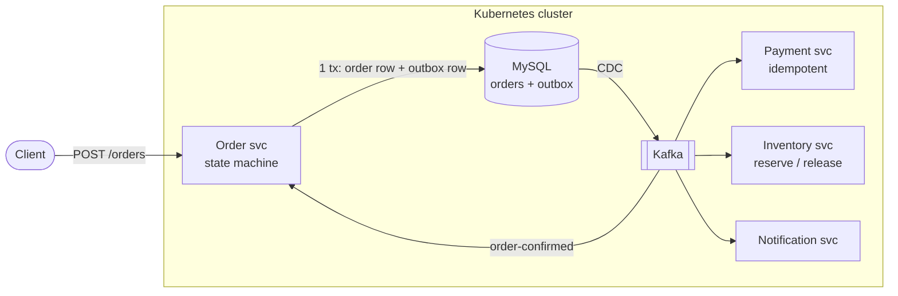

# OrderFlow

**An event-driven order & payment platform built to be broken on purpose.**

> **The invariant this project defends:**
> Under any single failure — pod kill, Kafka broker kill, network fault, deploy in progress —
> **no accepted order is ever lost, and no payment is ever executed twice.**

Most demo projects show a system working. This one is built to show a system *failing*, then fixed
until it stops failing — with every failure reproduced on command and written up as a war story.

---

## Status

🚧 **Phase 0 — foundations.** In progress, built in public.

| | |
|---|---|
| ✅ Done | Order service (REST + MySQL), containerized, running on Kubernetes (kind) with externalized config, Service, and a monorepo build |
| 🔜 Next | Health probes, resource limits, rolling updates — then Kafka |
| 📋 Planned | Payment + inventory services, transactional outbox + CDC, saga with compensation, idempotent consumers, DLQs, observability, chaos testing |

Roadmap: Phase 0 foundations → Phase 1 build it *wrong* (dual-write, double charges) →
Phase 2 correctness (outbox, idempotency, saga) → Phase 3 production-readiness (tracing, SLOs, chaos) → Phase 4 ship.

---

## Target architecture



Order fulfilment is a **saga**: `order-created → stock-reserved → payment-completed → order-confirmed`,
with compensation (release stock) when payment fails.

*Today, only the order service and its database exist. Everything else is the target.*

---

## Stack

Java 25 · Spring Boot 4 · MySQL · Docker · Kubernetes (kind) · Maven multi-module
— with Kafka, Debezium, Prometheus/Grafana and OpenTelemetry arriving in later phases.

## Repository layout

```
orderflow/
├── pom.xml                 # parent / aggregator
├── services/
│   └── order/              # order service (REST API + order state machine)
├── k8s/                    # Kubernetes manifests
│   ├── configmap.yaml
│   ├── secret.yaml.example # copy to secret.yaml and fill in
│   ├── mysql.yaml
│   ├── deployment.yaml
│   └── service.yaml
├── Dockerfile
└── docker-compose.yml      # local run: app + MySQL
```

---

## Run it

### Locally (Docker Compose)

```bash
docker compose up --build
curl http://localhost:8080/actuator/health
```

### On Kubernetes (kind)

```bash
# 1. cluster + image
kind create cluster --name orderflow
docker build -t orderflow-api:local .
kind load docker-image orderflow-api:local --name orderflow

# 2. config — the real secret is gitignored
cp k8s/secret.yaml.example k8s/secret.yaml   # then fill in the values
kubectl apply -f k8s/

# 3. reach it
kubectl port-forward svc/orderflow-api 8080:80
curl http://localhost:8080/actuator/health    # {"status":"UP"}
```

### Build from source

```bash
./mvnw clean package                      # all modules
./mvnw spring-boot:run -pl services/order # run the order service
```

---

## Why this project exists

Production incidents rarely come from one component failing — they come from the interactions
between components under partial failure. This project is a deliberate exercise in causing those
interactions, diagnosing them, and fixing them properly: dual writes, at-least-once duplicates,
poison messages, consumer rebalances, broker loss, pod death mid-transaction, OOMKills,
misconfigured probes.

Each one gets caused on purpose, fixed, and written up.
