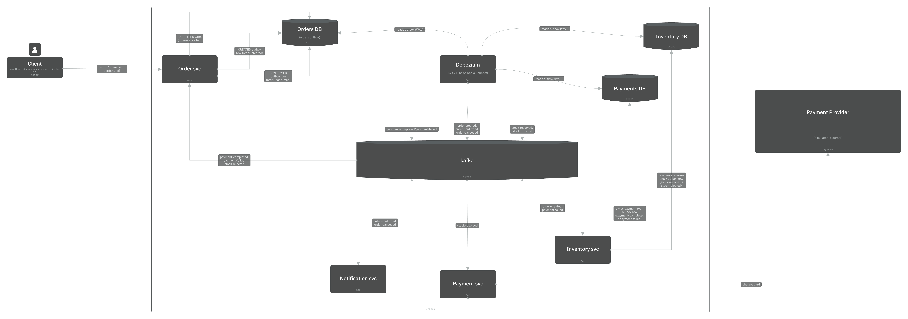
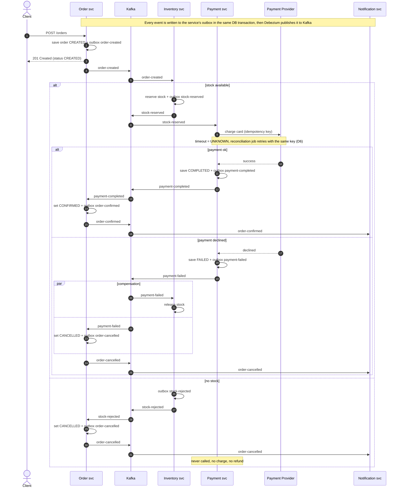

# 🏗️ Architecture

The **target** architecture of OrderFlow. Today only the order service and its database exist.
Why it looks like this: see [decisions](decisions.md) D2 to D6.

---

## Containers (C4 level 2)

The full picture, drawn in IcePanel ([open the interactive version](https://s.icepanel.io/qjQk3YauZVn2JL/LMt1): zoom, click objects, step through the flow):

Each service owns its database (D2) and writes an outbox row in the same transaction as its data (D3).
Debezium reads the database log (WAL) and publishes the outbox rows to Kafka (D5). No service writes to Kafka directly.
Consumers pull from Kafka; Debezium does not know who reads the events.

---

## Order saga (sequence)

In what order. One diagram, three paths: happy, payment failed, no stock.
Debezium is left out to keep it readable: every arrow to Kafka means "outbox row, then Debezium publishes it".

- `alt` / `else`: only one branch happens (if / else)
- `par` / `and`: both branches happen, in any order

The client gets `201` right away with status `CREATED`; the final status (`CONFIRMED` or `CANCELLED`) arrives later
through `GET /orders/{id}`. That gap is eventual consistency.
